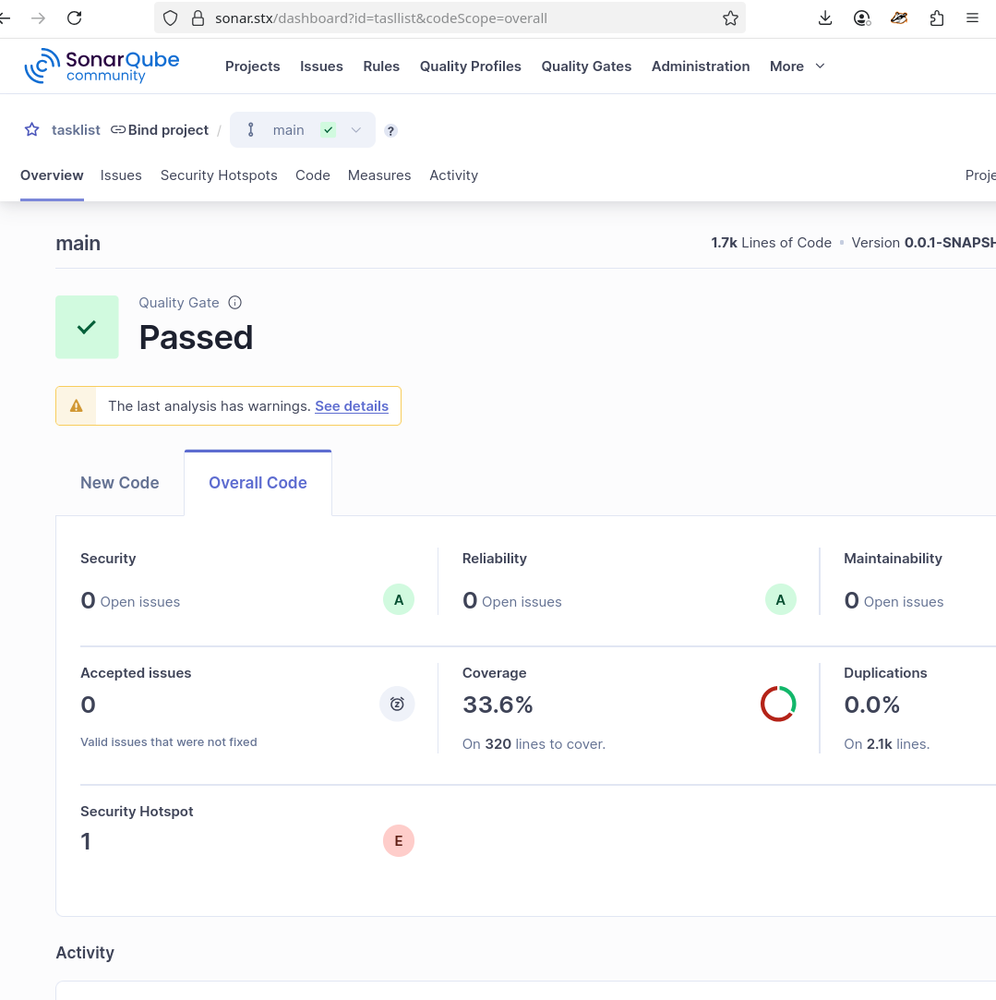

# Tasklist

This application helps you organize creating and accessing tasks for users.

You can access Swagger and see all available endpoints by
visiting `http://localhost:8086/swagger-ui/index.html`

## Sequence diagram


## Component diagram


Main application communicates with cache (we use Redis), database (we use
Postgresql), storage (we use MinIO).

## Class diagram


We have two main classes - **User** and **Task**.

**User** class represents user in this application. User can log in, create and
update tasks.

User can have roles - `ROLE_USER` or `ROLE_ADMIN`.

**Task** class represents task in this application. Task can be created by user.

Task can have images.

## Environments

To run this application you need to create `.env` file in root directory with
next environments:

- `HOST` - host of Postgresql database
- `POSTGRES_USERNAME` - username for Postgresql database
- `POSTGRES_PASSWORD` - password for Postgresql database
- `POSTGRES_DATABASE` - name of Postgresql database
- `POSTGRES_SCHEMA` - name of Postgresql schema
- `REDIS_HOST` - host of Redis instance
- `REDIS_PASSWORD` - password for Redis
- `JWT_SECRET` - secret string for JWT tokens
- `MINIO_BUCKET` - name of bucket for MinIO
- `MINIO_URL` - URL of MinIO instance
- `MINIO_ACCESS_KEY` - access key of MinIO
- `MINIO_SECRET_KEY` - secret key of MinIO
- `SPRING_MAIL_HOST` - host of mail server
- `SPRING_MAIL_PORT` - port of mail server
- `SPRING_MAIL_USERNAME` - username of mail server
- `SPRING_MAIL_PASSWORD` - password of mail server

You can use example `.env.example` file with some predefined environments.

## Instructions


### Run local with Docker Compose and Task List Application
To start the application and Redis, Postgresql, MinIO stack:
```bash
$ mvn clean install
$ docker compose up -d
$ mvn spring-boot:run
$ docker compose down -v
```

```
mvn jacoco:report
```

### Execute Sonar Scanner and Analysis Results
```
$ mvn sonar:sonar -Dsonar.host.url=<SONARCUBE_HOST> -Dsonar.projectKey=tasklist -Dsonar.login=<SONARCUBE_TOKEN>
```


### Jenkins Credentials 


### Jenkins Pipeline


### Jenkins Pipeline Output 


### When is @SneakyThrows Acceptable?

While @SneakyThrows is generally discouraged, it may be acceptable in limited cases, such as:

    Writing test code where brevity is more important than robustness.
    Prototyping or proof-of-concept code that will not go into production.

Even in these cases, its use should be documented and carefully reviewed.